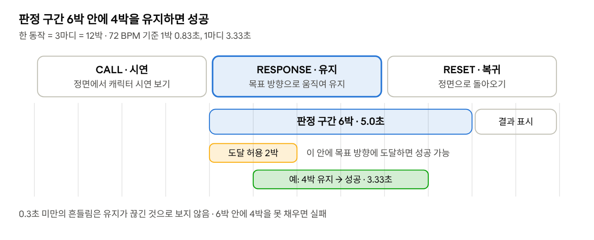
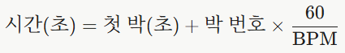

# 동작 순서 및 리듬 설계

리듬타조 - 2020038041 박태훈

## 1. 기본 원칙

치료 보조가 목적이므로 판정은 너그럽게 하고, 모든 시간은 음악 재생 시간을 기준으로 한다.

- **판정은 너그럽게**: 점수 경쟁보다 "정해진 방향으로 움직이고 잠깐 유지하는 습관"을 목표로 한다.
- **시간 기준**: 모든 시간은 음악 재생 시간(초)이다. 판정 쪽은 `audio.currentTime`과 비교한다.
- **동작 라벨**: `src/motion/motionDetector.ts`의 `MotionType`을 그대로 사용한다. `CENTER`는 목표 동작으로 사용하지 않는다.
- **유지 시간**: NHS 권장(각 동작 3~5초 유지)에 맞춘다.

## 2. 한 동작의 흐름 (3마디)

한 동작은 시연, 응답·유지, 복귀 3마디로 이루어지며, 72 BPM 기준 10초이다.



판정 구간은 RESPONSE 마디 전체와 RESET 마디 앞 2박에 걸쳐 있으므로, 조금 늦게 도달해도 4박을 채울 수 있다.

| 마디 | 구간 | 사용자 | 게임 |
|---|---|---|---|
| 1 | CALL (시연) | 정면 유지, 시연 보기 | 캐릭터가 동작 시연, 방향 라벨과 소리로 안내 |
| 2 | RESPONSE (응답·유지) | 목표 방향으로 움직여 유지 | 유지 판정 시작 |
| 3 | RESET (복귀) | 정면으로 돌아오기 | 앞 2박: 판정 계속 / 뒤 2박: 결과 표시 |

## 3. 판정 규칙 (1번 담당 구현 기준)

목표 방향을 6박 판정 구간 안에 연속 4박(72 BPM 기준 3.33초) 유지하면 성공으로 판정한다.

| 항목 | 값 | 72 BPM 기준 |
|---|---|---|
| 판정 구간 | RESPONSE 마디 첫 박부터 6박 | 5.0초 |
| 성공 조건 | 목표 방향을 연속 4박 유지 | 3.33초 |
| 늦은 도달 허용 | 판정 구간 시작 후 2박 안에 도달하면 성공 가능 | 1.67초 |
| 흔들림 허용 | 목표 방향에서 0.3초 미만 벗어난 것은 유지가 끊긴 것으로 보지 않음 | - |
| 결과 | 성공 / 실패 두 가지 | - |
| 성공 시점 | 4박 유지가 채워지는 즉시 | - |
| 실패 시점 | 판정 구간이 끝날 때까지 4박을 못 채우면 | - |

- 흔들림 허용은 판별 기준값(yaw ±20°, pitch·roll ±15°) 근처에서 라벨이 프레임마다 바뀌는 경우를 실패로 처리하지 않기 위한 것이다.
- 정면 복귀(`CENTER`)는 판정 조건에 포함하지 않는다. RESET 마디는 다음 동작을 준비하는 시간이다.
- 실패하더라도 게임은 멈추지 않고 다음 동작으로 넘어간다.

## 4. 동작 순서

튜토리얼은 6방향을 한 번씩, 본 게임은 6방향을 3바퀴(18동작) 진행한다.

### 방향 순서 (1바퀴 = 6동작)

02 슬라이드의 NHS 운동 순서(숙이기 → 들기 → 기울이기 → 돌리기)를 따르며, 좌우는 연달아 배치한다.

1. `FLEXION` (고개 숙이기)
2. `EXTENSION` (고개 들기)
3. `LEFT_TILT` (왼쪽 기울이기)
4. `RIGHT_TILT` (오른쪽 기울이기)
5. `LEFT_TURN` (왼쪽 돌리기)
6. `RIGHT_TURN` (오른쪽 돌리기)

왼쪽/오른쪽은 사용자 기준이다. 화면 속 캐릭터를 거울처럼 보여줄지는 3.2 담당과 정한다.

### 튜토리얼과 본 게임

| 구분 | 동작 수 | 길이 (72 BPM) | 비고 |
|---|---|---|---|
| 튜토리얼 | 6 (각 방향 1번) | 준비 1마디 + 18마디, 약 63초 | 점수 기록 없이 연습용 |
| 본 게임 | 18 (6방향 × 3바퀴) | 준비 1마디 + 54마디, 약 183초 | 끝난 뒤 1마디 동안 음악을 줄이며 종료 |

### 마디 배치 공식

`i`번째 동작(0부터 시작)의 위치는 다음과 같다. 0번 마디는 준비 구간이다.

| 구간 | 마디 번호 | 박 번호 (마디 × 4) |
|---|---|---|
| CALL | 1 + 3i | 4 + 12i |
| RESPONSE | 2 + 3i | 8 + 12i |
| RESET | 3 + 3i | 12 + 12i |



## 5. 사용할 곡

세 곡 모두 템포가 일정하여 같은 규칙을 그대로 적용할 수 있으며, 본 게임(55마디)을 모두 담을 수 있는 길이이다.

| 곡 | BPM (측정값) | 첫 박 | 1마디 | 곡 길이(마디) | 본 게임 후 남는 마디 |
|---|---|---|---|---|---|
| Study And Relax | 72.00 | 0.080초 | 3.333초 | 65 | 10 |
| Late Night Radio | 72.00 | 0.275초 | 3.333초 | 77 | 22 |
| Bleeping Demo | 73.00 | 0.480초 | 3.288초 | 63 | 8 |

- BPM은 음원 파일에서 직접 측정한 값이다. Bleeping Demo는 공개값이 74 BPM이지만 실제로는 73 BPM이므로, 반드시 측정값을 사용한다.
- 세 곡 모두 곡 끝까지 박자가 밀리지 않는다 (측정 오차 15ms 이내). 클릭음을 섞은 확인용 파일로 들어 보았을 때도 박자와 마디 첫 박이 어긋나지 않았다.
- 모든 곡은 Kevin MacLeod (incompetech.com), CC BY 4.0이다. 출처 표기는 `public/audio/CREDITS.md`에 둔다. ([라이선스 안내](https://incompetech.com/music/royalty-free/faq.html))

## 6. 채보 파일 형식

곡마다 JSON 파일 하나를 둔다. 시간은 박 번호로 적고, 초 단위 변환은 4절의 공식을 따른다.

```json
{
    "id": "study_and_relax",
    "title": "Study And Relax",
    "artist": "Kevin MacLeod",
    "audio": "/audio/study_and_relax.mp3",
    "bpm": 72,
    "offsetSec": 0.08,
    "beatsPerBar": 4,
    "judge": {
        "windowBeats": 6,
        "holdBeats": 4,
        "dropToleranceSec": 0.3
    },
    "notes": [
        { "motion": "FLEXION", "callBeat": 4, "responseBeat": 8 },
        { "motion": "EXTENSION", "callBeat": 16, "responseBeat": 20 }
    ]
}
```

| 필드 | 의미 |
|---|---|
| `offsetSec` | 0번 박(첫 마디 첫 박)의 재생 시간 |
| `judge.windowBeats` | 판정 구간 길이(박) |
| `judge.holdBeats` | 성공에 필요한 연속 유지 길이(박) |
| `judge.dropToleranceSec` | 유지 중 허용하는 흔들림(초) |
| `notes[].motion` | 목표 동작 (`MotionType`, `CENTER` 제외) |
| `notes[].callBeat` | 시연 시작 박 |
| `notes[].responseBeat` | 판정 구간 시작 박 |
